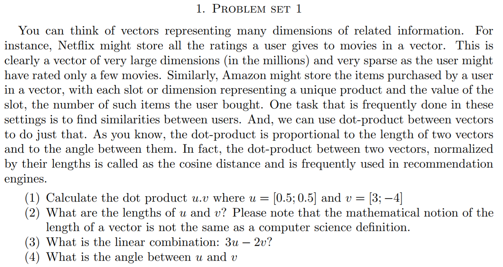
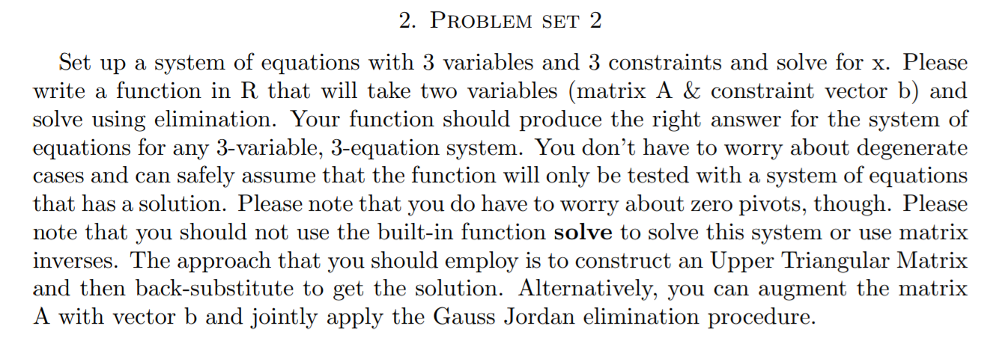
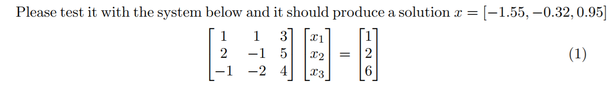

**_A:_**
**_(1) Calculate the dot product u.v where u = [0.5; 0.5] and v = [3; -4]_**

```{r, echo=T}
#Initiate the vector
u = c(0.5,0.5)
v = c(3,-4)

#dot product
result = u%*%v
```
**_Dot product of vectors: `r result`_**

**_(2) What are the lengths of u and v? Please note that the mathematical notion of the length of a vector is not the same as a computer science definition._**

```{r, echo=T}
#Initiate the vector
u = c(0.5,0.5)
#length of u
result = sqrt(u%*%u)
```
**_Length of u: `r result`_**

```{r, echo=T}
v = c(3,-4)
#length of v
result = sqrt(v%*%v)
```
**_Length of v: `r result`_**

**_(3) What is the linear combination: 3u - 2v?_** 

$3\left[\begin{array}{cc}0.5 & 0.5\end{array}\right] - 2\left[\begin{array}{cc}3 & -4\end{array}\right]$

```{r, echo=T}
u = c(0.5,0.5)
v = c(3,-4)

result = (3*u) - (2*v) 
```
**_Linear combination: [`r result`]_**

**_(4) What is the angle between u and v?_**

$cos\theta = \frac{dot\ product\ of\ u.v}{(magnitude\ of\ u) * (magnitude\ of\ v)}$

$cos\theta = \frac{u.v}{||u|| * ||v||}$

```{r, echo=T}
u = c(0.5,0.5)
v = c(3,-4)

dotproduct = u%*%v
magnitudeu = sqrt(u%*%u)
magnitudev = sqrt(v%*%v)

costheta = dotproduct / (magnitudeu * magnitudev)

theta = acos(costheta)
```

$cos\theta =$ `r costheta`


$\theta = cos^-1(\frac{u.v}{||u|| * ||v||})^0$

**_Angle between vectors ($\theta$): `r theta` $^0$_**







**_A:_**

```{r , echo=T}
GJ_linear_eq <- function(A, b){
  #initiate result matrix
  x = matrix(c(0,0,0), nrow = 3)
  
  #bind both matrices
  res = cbind(A, b)
  
  #Check if first row first value is 0 if so swap the rows
  if (res[1,1] == 0){
    res = res[c(2,1,3),]
  }
  
  #Check if second row second value is 0 if so swap the rows
  if (res[2,2] == 0){
    res = res[c(3,2,1),]
  }
  
  #Check if second row first value is 0 if not make it zero by 
  #multiplying first row first value with second row and second row first value with first row
  #then substract resultant first row from resultant second row
  if (res[2,1] != 0){
    res1 = (res[2,1] * res[1,])
    res2 = (res[1,1] * res[2,])
    res[2,] =  res1 - res2
  }
  
  #repeat above process for all the values
  if (res[3,1] != 0){
    res1 = (res[3,1] * res[1,])
    res2 = (res[1,1] * res[3,])
    res[3,] = res1 - res2
  }
  
  if (res[3,2] != 0){
    res1 = (res[3,2] * res[2,])
    res2 = (res[2,2] * res[3,])
    res[3,] = res1 - res2
  }
  
  if (res[1,2] != 0){
    res1 = (res[2,2] * res[1,])
    res2 = (res[1,2] * res[2,])
    res[1,] = res1 - res2
  }
  
  if (res[1,3] != 0){
    res1 = (res[3,3] * res[1,])
    res2 = (res[1,3] * res[3,])
    res[1,] = res1 - res2
  }
  
  if (res[2,3] != 0){
    res1 = (res[3,3] * res[2,])
    res2 = (res[2,3] * res[3,])
    res[2,] = res1 - res2
  }
  
  #Once matrix is result with diagonal values, and above and below values are zero, divide each row by its non zero value
  res[1,] = res[1,]/res[1,1]
  res[2,] = res[2,]/res[2,2]
  res[3,] = res[3,]/res[3,3]
  
  #Values left in 4 column are results
  x[1] = res[1,4]
  x[2] = res[2,4]
  x[3] = res[3,4]
  return(x)
}
```

```{r, echo = T}
A = matrix(c(1,2,-1,1,-1,-2,3,5,4), nrow=3, ncol=3)
b = matrix(c(1, 2, 6), nrow = 3)

result = GJ_linear_eq(A, b)
```

**_Value of ${x}_1$ = `r result[1]`, ${x}_2$ = `r result[2]`, ${x}_3$ = `r result[3]`_**
